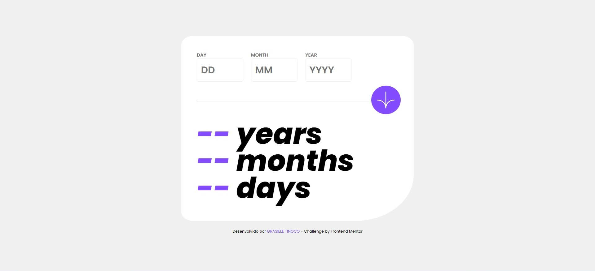

# Frontend Mentor | Age Calculator App

### 💻 Descodificadas - Trilha 3: Desafio Frontend Mentor

##### 📝Desafio

Criar um Aplicativo Calculadora de Idade do site Frontend Mentor e fazer com que pareça o mais próximo possível do design proposto.

##### 📌Os Usuários Devem ser Capazes de:

- Ver a idade em anos, meses e dias após enviar uma data válida por meio do formulário

- Receber os erros de validação se:
   - Qualquer campo estiver vazio quando o formulário for enviado
   
   - O número do dia não estiver entre 1-31
   
   - O número do mês não estiver entre 1-12
   
   - O ano estiver no futuro
   
   - A data for inválida, por exemplo 31/04/1991 (há 30 dias em Abril)
   
     

##### ⚙️Desenvolvimento

- HTML
- CSS
- JavaScript
